# Suggestion/Recommendation System Architecture

## Overview

This document describes the architecture for a new feature that provides actionable suggestions when:
1. A project requires a higher-level authorization (PC instead of DP)
2. A project is near threshold boundaries where small changes could simplify procedures
3. A project has constraining conditions that could be mitigated

### Design Philosophy

The suggestion system follows the principle of **proactive guidance** - helping users understand not just what authorization they need, but what small changes could simplify their project while maintaining their core objectives.

---

## 1. TypeScript Interfaces for Suggestions

### 1.1 Backend Interface (analysis.service.ts)

```typescript
/**
 * Individual adjustment suggestion
 * Aligns with the documented `propositionsAjustement` field
 */
interface AdjustmentSuggestion {
  /** Unique identifier for this suggestion type */
  id: string;

  /** Human-readable description of the suggested change */
  description: string;

  /** Impact level on the project */
  impactSurProjet: 'faible' | 'moyen' | 'important';

  /** The questionnaire field that would need to change */
  targetField: string;

  /** Current value from questionnaire */
  currentValue: number | string;

  /** Suggested new value */
  suggestedValue: number | string;

  /** The threshold that triggers this suggestion */
  thresholdValue: number | string;

  /** Current authorization type with current values */
  currentAuthorizationType: 'NONE' | 'DP' | 'PC' | 'PA';

  /** Resulting authorization type if suggestion is applied */
  resultingAuthorizationType: 'NONE' | 'DP' | 'PC' | 'PA';

  /** Category of suggestion */
  category: 'surface_reduction' | 'height_reduction' | 'cover_removal' | 'zone_optimization' | 'other';

  /** Optional: specific PLU zone context */
  zoneContext?: string;
}

/**
 * Extended LLM Analysis Result with Suggestions
 */
interface LLMAnalysisResult {
  authorizationType: 'NONE' | 'DP' | 'PC' | 'PA';
  feasibilityStatus: 'compatible' | 'compatible_a_risque' | 'probablement_incompatible';
  summary: string;
  constraints: Array<{
    type: string;
    description: string;
    severity: 'faible' | 'moyenne' | 'elevee';
  }>;
  requiredDocuments: Array<{
    code: string;
    name: string;
    description: string;
    required: boolean;
  }>;

  /** NEW: Adjustment suggestions */
  suggestions?: AdjustmentSuggestion[];
}
```

### 1.2 Frontend Interface (frontend/src/types/index.ts)

```typescript
/**
 * Suggestion display data for frontend
 */
export interface Suggestion {
  id: string;
  description: string;
  impact: 'low' | 'medium' | 'high';
  targetField: string;
  currentValue: number | string;
  suggestedValue: number | string;
  threshold: number | string;
  currentAuth: AuthorizationType;
  resultingAuth: AuthorizationType;
  category: SuggestionCategory;
  zoneContext?: string;
}

export type SuggestionCategory =
  | 'surface_reduction'
  | 'height_reduction'
  | 'cover_removal'
  | 'zone_optimization'
  | 'other';

export interface SuggestionImpact {
  icon: string;  // emoji or icon class
  color: string; // tailwind color class
  label: string; // display label
}

export const suggestionImpactMap: Record<string, SuggestionImpact> = {
  low: { icon: '✨', color: 'text-green-600', label: 'Impact faible' },
  medium: { icon: '⚡', color: 'text-orange-500', label: 'Impact moyen' },
  high: { icon: '🔧', color: 'text-red-500', label: 'Impact important' },
};

export const suggestionCategoryLabels: Record<SuggestionCategory, string> = {
  surface_reduction: 'Réduction de surface',
  height_reduction: 'Réduction de hauteur',
  cover_removal: 'Modification de couverture',
  zone_optimization: 'Optimisation PLU',
  other: 'Autre ajustement',
};

/**
 * Extended AnalysisResult with suggestions
 */
export interface AnalysisResult {
  id: string;
  projectId: string;
  authorizationType: AuthorizationType;
  constraints: Constraint[];
  requiredDocuments: RequiredDocument[];
  llmResponse?: string;
  feasibilityStatus?: 'compatible' | 'compatible_a_risque' | 'probablement_incompatible';
  summary?: string;
  createdAt: string;

  /** NEW: Suggestions for project optimization */
  suggestions?: Suggestion[];
}
```

---

## 2. LLM Prompt Modifications

### 2.1 System Prompt Additions

Add the following section to the existing system prompt in [`analysis.service.ts`](backend/src/modules/analysis/analysis.service.ts:291):

```typescript
const systemPromptAdditions = `

=== GÉNÉRATION DE SUGGESTIONS D'AJUSTEMENT ===

En plus de l'analyse, tu dois TOUJOURS générer des suggestions d'ajustement quand:

1. **Proximité de seuil (< 20% au-dessus)**: Si une valeur dépasse un seuil de moins de 20%, suggérer une réduction
   - Extension 45m² en zone U → suggérer 40m² (seuil: 40m²)
   - Piscine 105m² → suggérer 100m² (seuil: 100m² pour DP)
   - Abri 22m² → suggérer 20m² (seuil: 20m² pour DP)

2. **Passage PC → DP possible**: Si un PC est requis mais qu'un DP serait possible avec une petite modification

3. **Passage DP → NONE possible**: Si une DP est requise mais qu'aucune autorisation serait nécessaire avec un ajustement

=== SEUILS DE RÉFÉRENCE ===

| Type de projet | Seuil NONE | Seuil DP | Seuil PC | Conditions |
|----------------|------------|----------|----------|------------|
| Extension zone U* | - | ≤40m² | >40m² | Zone urbaine avec PLU |
| Extension zone A/N | - | ≤20m² | >20m² | Zone agricole/naturelle |
| Piscine | ≤10m² | ≤100m² | >100m² | Sans abri haut |
| Piscine + abri haut | - | - | Toute surface | Abri ≥1.8m = PC |
| Abri de jardin | ≤5m² | ≤20m² | >20m² | Emprise au sol |
| Clôture standard | - | Toute hauteur | - | Sauf PLU restrictif |
| Clôture >2m | - | ≤2m | >2m | Certaines communes |

=== FORMAT JSON DES SUGGESTIONS ===

Ajoute ce champ à ta réponse JSON quand des suggestions sont pertinentes:

"suggestions": [
  {
    "id": "extension_surface_reduction",
    "description": "En réduisant la surface de votre extension de 45m² à 40m², vous passeriez d'un Permis de Construire à une simple Déclaration Préalable, réduisant ainsi les délais et la complexité du dossier.",
    "impactSurProjet": "faible",
    "targetField": "extension_surface_plancher",
    "currentValue": 45,
    "suggestedValue": 40,
    "thresholdValue": 40,
    "currentAuthorizationType": "PC",
    "resultingAuthorizationType": "DP",
    "category": "surface_reduction",
    "zoneContext": "Zone urbaine U"
  }
]

RÈGLES POUR LES SUGGESTIONS:
- Maximum 3 suggestions par analyse
- Prioriser par impact le plus faible (changements minimes)
- Ne PAS suggérer si le changement dépasse 25% de la valeur actuelle
- Toujours expliquer le bénéfice concret (délais, complexité, coût)
- Inclure le contexte de zone PLU quand pertinent`;
```

### 2.2 User Prompt Template Update

Update the user prompt template to explicitly request suggestions:

```typescript
const userPromptAdditions = `

=== GÉNÉRATION DE SUGGESTIONS ===
Si le projet dépasse certains seuils réglementaires, propose des ajustements concrets.
Exemples:
- Surface d'extension proche du seuil de 40m² en zone U
- Surface de piscine proche du seuil de 100m²
- Hauteur de clôture proche du seuil de 2m

Génère les suggestions dans le format JSON spécifié.`;
```

### 2.3 Updated JSON Schema for Response

```typescript
const responseJsonSchema = `{
  "authorizationType": "NONE" | "DP" | "PC" | "PA",
  "feasibilityStatus": "compatible" | "compatible_a_risque" | "probablement_incompatible",
  "summary": "...",
  "constraints": [...],
  "requiredDocuments": [...],
  "suggestions": [
    {
      "id": "string - unique identifier",
      "description": "string - French description with concrete benefit",
      "impactSurProjet": "faible" | "moyen" | "important",
      "targetField": "string - questionnaire field id",
      "currentValue": "number or string",
      "suggestedValue": "number or string",
      "thresholdValue": "number or string",
      "currentAuthorizationType": "NONE" | "DP" | "PC" | "PA",
      "resultingAuthorizationType": "NONE" | "DP" | "PC" | "PA",
      "category": "surface_reduction" | "height_reduction" | "cover_removal" | "zone_optimization" | "other",
      "zoneContext": "string - optional PLU zone context"
    }
  ]
}`;
```

---

## 3. Database Schema Changes

### 3.1 Option A: Store in Existing JSON Field (Recommended)

No schema migration required. Store suggestions in the existing `llmResponse` JSON field or within the `constraints` JSON field by extending its structure.

**Approach**: The `llmResponse` field already stores the full JSON response. The frontend can parse `suggestions` from this field.

### 3.2 Option B: Add Dedicated Column (Alternative)

If we want explicit database querying on suggestions:

```prisma
// In schema.prisma - AnalysisResult model
model AnalysisResult {
  id                String            @id @default(uuid())
  projectId         String            @unique
  authorizationType AuthorizationType
  constraints       Json
  requiredDocuments Json
  llmResponse       String?           @db.Text
  feasibilityStatus String?
  summary           String?           @db.Text

  // NEW: Dedicated suggestions field
  suggestions       Json?             // JSON array of AdjustmentSuggestion

  createdAt         DateTime          @default(now())
  project           Project           @relation(fields: [projectId], references: [id], onDelete: Cascade)

  @@map("analysis_results")
}
```

**Migration SQL**:
```sql
ALTER TABLE analysis_results ADD COLUMN suggestions JSONB;
```

### 3.3 Recommendation

**Use Option A** (leverage existing `llmResponse` field) for initial implementation:
- No migration required
- Backwards compatible
- Suggestions are already part of LLM response JSON
- Frontend parses from `llmResponse` when needed

---

## 4. Mock Analysis Threshold Rules

### 4.1 Threshold Configuration

```typescript
// backend/src/modules/analysis/thresholds.ts

interface ThresholdRule {
  projectType: string;
  field: string;
  thresholds: {
    none?: number;       // Below this = no authorization
    dp: number;          // Below or equal = DP, above = PC
    dpCondition?: string; // Additional condition for DP threshold
  };
  zoneDependent?: boolean;
  urbanZoneThreshold?: number;  // For urban zones (U*)
  otherZoneThreshold?: number;  // For A, N zones or no PLU
}

const THRESHOLD_RULES: ThresholdRule[] = [
  // EXTENSION
  {
    projectType: 'EXTENSION',
    field: 'extension_surface_plancher',
    thresholds: { dp: 40 },  // Default for urban zones
    zoneDependent: true,
    urbanZoneThreshold: 40,
    otherZoneThreshold: 20,
  },

  // POOL
  {
    projectType: 'POOL',
    field: 'piscine_surface',
    thresholds: { none: 10, dp: 100 },
    dpCondition: 'piscine_abri !== "abri_haut"',
  },

  // SHED
  {
    projectType: 'SHED',
    field: 'abri_surface',
    thresholds: { none: 5, dp: 20 },
  },

  // FENCE
  {
    projectType: 'FENCE',
    field: 'cloture_hauteur',
    thresholds: { dp: 2 },
  },
];
```

### 4.2 Suggestion Generation Logic

```typescript
// backend/src/modules/analysis/suggestion-generator.ts

interface SuggestionContext {
  projectType: string;
  responses: Record<string, unknown>;
  pluZone: string | null;
  currentAuthType: 'NONE' | 'DP' | 'PC' | 'PA';
}

function generateMockSuggestions(context: SuggestionContext): AdjustmentSuggestion[] {
  const suggestions: AdjustmentSuggestion[] = [];
  const { projectType, responses, pluZone, currentAuthType } = context;

  // Get applicable threshold rules
  const rules = THRESHOLD_RULES.filter(r => r.projectType === projectType);

  for (const rule of rules) {
    const currentValue = responses[rule.field] as number;
    if (!currentValue) continue;

    // Determine applicable threshold
    let threshold = rule.thresholds.dp;
    if (rule.zoneDependent && pluZone) {
      const isUrbanZone = pluZone.toUpperCase().startsWith('U');
      threshold = isUrbanZone
        ? rule.urbanZoneThreshold!
        : rule.otherZoneThreshold!;
    }

    // Check if above threshold but within 25%
    const percentAbove = ((currentValue - threshold) / threshold) * 100;

    if (percentAbove > 0 && percentAbove <= 25) {
      // Check what authorization would result from reduction
      const resultingAuth = determineAuthorizationType(
        projectType,
        { ...responses, [rule.field]: threshold },
        pluZone
      );

      // Only suggest if it actually improves the situation
      if (isAuthImprovement(currentAuthType, resultingAuth)) {
        suggestions.push(generateSuggestion(
          rule,
          currentValue,
          threshold,
          currentAuthType,
          resultingAuth,
          pluZone
        ));
      }
    }

    // Also check for NONE threshold
    if (rule.thresholds.none && currentValue <= rule.thresholds.dp) {
      const noneThreshold = rule.thresholds.none;
      const percentAboveNone = ((currentValue - noneThreshold) / noneThreshold) * 100;

      if (percentAboveNone > 0 && percentAboveNone <= 50 && currentAuthType === 'DP') {
        suggestions.push(generateSuggestion(
          rule,
          currentValue,
          noneThreshold,
          'DP',
          'NONE',
          pluZone
        ));
      }
    }
  }

  // Priority sort: lower impact first, then smaller reduction percentage
  return suggestions
    .sort((a, b) => {
      const impactOrder = { faible: 0, moyen: 1, important: 2 };
      return impactOrder[a.impactSurProjet] - impactOrder[b.impactSurProjet];
    })
    .slice(0, 3); // Max 3 suggestions
}

function determineImpact(
  currentValue: number,
  suggestedValue: number
): 'faible' | 'moyen' | 'important' {
  const reductionPercent = ((currentValue - suggestedValue) / currentValue) * 100;

  if (reductionPercent <= 10) return 'faible';
  if (reductionPercent <= 20) return 'moyen';
  return 'important';
}

function isAuthImprovement(
  current: string,
  resulting: string
): boolean {
  const authOrder = { NONE: 0, DP: 1, PC: 2, PA: 3 };
  return authOrder[resulting] < authOrder[current];
}
```

### 4.3 Specific Rules by Project Type

```typescript
// EXTENSION Suggestions
const extensionRules = {
  // Zone U: 40m² threshold
  // Zone A/N: 20m² threshold
  generateSuggestion(surface: number, isUrbanZone: boolean): AdjustmentSuggestion | null {
    const threshold = isUrbanZone ? 40 : 20;
    const maxSuggestableValue = threshold * 1.25; // Only suggest if within 25%

    if (surface > threshold && surface <= maxSuggestableValue) {
      const zoneLabel = isUrbanZone ? 'zone urbaine' : 'zone agricole/naturelle';
      return {
        id: 'extension_surface_reduction',
        description: `En réduisant la surface de votre extension de ${surface}m² à ${threshold}m², vous passeriez d'un Permis de Construire à une simple Déclaration Préalable. Le seuil en ${zoneLabel} est de ${threshold}m².`,
        impactSurProjet: determineImpact(surface, threshold),
        targetField: 'extension_surface_plancher',
        currentValue: surface,
        suggestedValue: threshold,
        thresholdValue: threshold,
        currentAuthorizationType: 'PC',
        resultingAuthorizationType: 'DP',
        category: 'surface_reduction',
        zoneContext: `Zone PLU: ${zoneLabel}`,
      };
    }
    return null;
  }
};

// POOL Suggestions
const poolRules = {
  // 10m² = no authorization
  // 100m² = DP threshold (without high shelter)
  generateSuggestions(surface: number, hasHighShelter: boolean): AdjustmentSuggestion[] {
    const suggestions: AdjustmentSuggestion[] = [];

    // Pool cover suggestion
    if (hasHighShelter) {
      suggestions.push({
        id: 'pool_cover_removal',
        description: `En optant pour une couverture basse (< 1.8m) au lieu d'un abri haut, votre piscine de ${surface}m² ne nécessiterait qu'une Déclaration Préalable au lieu d'un Permis de Construire.`,
        impactSurProjet: 'moyen',
        targetField: 'piscine_abri',
        currentValue: 'abri_haut',
        suggestedValue: 'couverture_basse',
        thresholdValue: '1.8m de hauteur',
        currentAuthorizationType: 'PC',
        resultingAuthorizationType: surface <= 100 ? 'DP' : 'PC',
        category: 'cover_removal',
      });
    }

    // Surface reduction suggestions
    if (surface > 100 && surface <= 125 && !hasHighShelter) {
      suggestions.push({
        id: 'pool_surface_reduction',
        description: `Une piscine de 100m² ou moins ne nécessite qu'une Déclaration Préalable. Réduire de ${surface}m² à 100m² simplifierait vos démarches.`,
        impactSurProjet: determineImpact(surface, 100),
        targetField: 'piscine_surface',
        currentValue: surface,
        suggestedValue: 100,
        thresholdValue: 100,
        currentAuthorizationType: 'PC',
        resultingAuthorizationType: 'DP',
        category: 'surface_reduction',
      });
    }

    if (surface > 10 && surface <= 15) {
      suggestions.push({
        id: 'pool_no_auth',
        description: `Une piscine de 10m² ou moins ne nécessite aucune autorisation. Réduire de ${surface}m² à 10m² éliminerait toute démarche administrative.`,
        impactSurProjet: determineImpact(surface, 10),
        targetField: 'piscine_surface',
        currentValue: surface,
        suggestedValue: 10,
        thresholdValue: 10,
        currentAuthorizationType: 'DP',
        resultingAuthorizationType: 'NONE',
        category: 'surface_reduction',
      });
    }

    return suggestions;
  }
};

// SHED Suggestions
const shedRules = {
  // 5m² = no authorization
  // 20m² = DP threshold
  generateSuggestions(surface: number): AdjustmentSuggestion[] {
    const suggestions: AdjustmentSuggestion[] = [];

    if (surface > 20 && surface <= 25) {
      suggestions.push({
        id: 'shed_surface_reduction_dp',
        description: `En réduisant votre abri de ${surface}m² à 20m², vous passeriez d'un Permis de Construire à une Déclaration Préalable.`,
        impactSurProjet: determineImpact(surface, 20),
        targetField: 'abri_surface',
        currentValue: surface,
        suggestedValue: 20,
        thresholdValue: 20,
        currentAuthorizationType: 'PC',
        resultingAuthorizationType: 'DP',
        category: 'surface_reduction',
      });
    }

    if (surface > 5 && surface <= 7) {
      suggestions.push({
        id: 'shed_surface_reduction_none',
        description: `Un abri de 5m² ou moins ne nécessite aucune autorisation. Réduire de ${surface}m² à 5m² éviterait toute démarche.`,
        impactSurProjet: determineImpact(surface, 5),
        targetField: 'abri_surface',
        currentValue: surface,
        suggestedValue: 5,
        thresholdValue: 5,
        currentAuthorizationType: 'DP',
        resultingAuthorizationType: 'NONE',
        category: 'surface_reduction',
      });
    }

    return suggestions;
  }
};

// FENCE Suggestions
const fenceRules = {
  // 2m height threshold in many communes
  generateSuggestions(height: number): AdjustmentSuggestion[] {
    if (height > 2 && height <= 2.5) {
      return [{
        id: 'fence_height_reduction',
        description: `Une clôture de moins de 2 mètres peut bénéficier d'une procédure simplifiée dans de nombreuses communes. Réduire de ${height}m à 2m pourrait simplifier vos démarches.`,
        impactSurProjet: 'faible',
        targetField: 'cloture_hauteur',
        currentValue: height,
        suggestedValue: 2,
        thresholdValue: 2,
        currentAuthorizationType: 'DP', // or PC depending on commune
        resultingAuthorizationType: 'DP',
        category: 'height_reduction',
      }];
    }
    return [];
  }
};
```

---

## 5. Frontend Display Components

### 5.1 SuggestionCard Component

```tsx
// frontend/src/components/results/SuggestionCard.tsx
'use client';

import { Suggestion, suggestionImpactMap, suggestionCategoryLabels } from '@/types';
import { Card, CardContent, CardHeader, CardTitle } from '@/components/ui/card';
import { Badge } from '@/components/ui/badge';
import { Lightbulb, ArrowRight, Target } from 'lucide-react';

interface SuggestionCardProps {
  suggestion: Suggestion;
  onApply?: (suggestion: Suggestion) => void;
}

export function SuggestionCard({ suggestion, onApply }: SuggestionCardProps) {
  const impact = suggestionImpactMap[suggestion.impact];

  return (
    <Card className="border-blue-200 bg-blue-50/50 hover:bg-blue-50 transition-colors">
      <CardHeader className="pb-2">
        <div className="flex items-center justify-between">
          <div className="flex items-center gap-2">
            <Lightbulb className="h-5 w-5 text-blue-500" />
            <CardTitle className="text-base">Suggestion d'optimisation</CardTitle>
          </div>
          <Badge className={impact.color + ' bg-transparent'}>
            {impact.icon} {impact.label}
          </Badge>
        </div>
      </CardHeader>
      <CardContent className="space-y-4">
        {/* Description */}
        <p className="text-sm text-gray-700">{suggestion.description}</p>

        {/* Value Change Visual */}
        <div className="flex items-center gap-3 p-3 bg-white rounded-lg border">
          <div className="text-center">
            <p className="text-xs text-gray-500">Actuel</p>
            <p className="text-lg font-semibold text-red-600">
              {suggestion.currentValue}
              {typeof suggestion?.currentValue === 'number' ? 'm²' : ''}
            </p>
          </div>
          <ArrowRight className="h-5 w-5 text-gray-400" />
          <div className="text-center">
            <p className="text-xs text-gray-500">Suggéré</p>
            <p className="text-lg font-semibold text-green-600">
              {suggestion.suggestedValue}
              {typeof suggestion.suggestedValue === 'number' ? 'm²' : ''}
            </p>
          </div>
          <div className="ml-auto flex items-center gap-1 text-xs text-gray-500">
            <Target className="h-3 w-3" />
            Seuil: {suggestion.threshold}
          </div>
        </div>

        {/* Authorization Change */}
        <div className="flex items-center gap-2 text-sm">
          <Badge variant="outline" className="border-red-300 text-red-700">
            {suggestion.currentAuth}
          </Badge>
          <ArrowRight className="h-4 w-4 text-gray-400" />
          <Badge variant="outline" className="border-green-300 text-green-700">
            {suggestion.resultingAuth}
          </Badge>
        </div>

        {/* Category Badge */}
        <div className="flex items-center gap-2">
          <Badge variant="secondary" className="text-xs">
            {suggestionCategoryLabels[suggestion.category]}
          </Badge>
          {suggestion.zoneContext && (
            <Badge variant="outline" className="text-xs">
              {suggestion.zoneContext}
            </Badge>
          )}
        </div>
      </CardContent>
    </Card>
  );
}
```

### 5.2 SuggestionsList Component

```tsx
// frontend/src/components/results/SuggestionsList.tsx
'use client';

import { Suggestion } from '@/types';
import { SuggestionCard } from './SuggestionCard';
import { Card, CardContent, CardHeader, CardTitle, CardDescription } from '@/components/ui/card';
import { Sparkles } from 'lucide-react';

interface SuggestionsListProps {
  suggestions: Suggestion[];
  onApplySuggestion?: (suggestion: Suggestion) => void;
}

export function SuggestionsList({ suggestions, onApplySuggestion }: SuggestionsListProps) {
  if (!suggestions || suggestions.length === 0) {
    return null;
  }

  return (
    <Card className="border-blue-300">
      <CardHeader>
        <div className="flex items-center gap-2">
          <Sparkles className="h-5 w-5 text-blue-500" />
          <CardTitle className="text-lg">Suggestions d'optimisation</CardTitle>
        </div>
        <CardDescription>
          Des modifications mineures pourraient simplifier vos démarches administratives
        </CardDescription>
      </CardHeader>
      <CardContent>
        <div className="space-y-4">
          {suggestions.map((suggestion, index) => (
            <SuggestionCard
              key={suggestion.id || index}
              suggestion={suggestion}
              onApply={onApplySuggestion}
            />
          ))}
        </div>
      </CardContent>
    </Card>
  );
}
```

### 5.3 Integration in AnalysisResult.tsx

Add to the existing [`AnalysisResult.tsx`](frontend/src/components/results/AnalysisResult.tsx):

```tsx
// After constraints section, before legal disclaimer
{/* Suggestions Section */}
{analysis.suggestions && analysis.suggestions.length > 0 && (
  <SuggestionsList
    suggestions={analysis.suggestions}
    onApplySuggestion={(suggestion) => {
      // Future: implement "apply suggestion" flow
      // Could open a modal asking user to update questionnaire
      console.log('Apply suggestion:', suggestion);
    }}
  />
)}
```

### 5.4 Visual Design Specifications

```
┌─────────────────────────────────────────────────────────────────┐
│ 💡 Suggestion d'optimisation                    ✨ Impact faible │
├─────────────────────────────────────────────────────────────────┤
│                                                                   │
│  En réduisant la surface de votre extension de 45m² à 40m²,      │
│  vous passeriez d'un Permis de Construire à une simple           │
│  Déclaration Préalable.                                          │
│                                                                   │
│  ┌──────────┐      →      ┌──────────┐      🎯 Seuil: 40m²     │
│  │  Actuel  │             │ Suggéré  │                          │
│  │   45m²   │             │   40m²   │                          │
│  │   🔴     │             │   🟢     │                          │
│  └──────────┘             └──────────┘                          │
│                                                                   │
│  [ PC ] → [ DP ]                                                  │
│                                                                   │
│  🏷️ Réduction de surface  |  📍 Zone urbaine U                   │
│                                                                   │
└─────────────────────────────────────────────────────────────────┘
```

**Color Scheme**:
- Card background: `bg-blue-50/50` (light blue tint)
- Border: `border-blue-200`
- Header icon: `text-blue-500`
- Impact badges: green/orange/red based on level
- Current value: `text-red-600`
- Suggested value: `text-green-600`

---

## 6. Implementation Order and Dependencies

### Phase 1: Backend Core (2-3 days)


**Tasks**:
1. Create `backend/src/modules/analysis/thresholds.ts` with threshold configuration
2. Create `backend/src/modules/analysis/suggestion-generator.ts` with generation logic
3. Update system prompt in `analysis.service.ts`
4. Update `LLMAnalysisResult` interface
5. Integrate suggestion generation in `getMockAnalysis()`
6. Manual testing with different project types

### Phase 2: Database & API (1 day)


**Tasks**:
1. Decide: use existing `llmResponse` field or add dedicated `suggestions` column
2. Update `analyzeProject()` to save suggestions
3. Ensure `getAnalysisResult()` returns suggestions
4. (Optional) Add migration for dedicated column

### Phase 3: Frontend Display (2 days)


**Tasks**:
1. Add TypeScript interfaces to `frontend/src/types/index.ts`
2. Create `SuggestionCard` component
3. Create `SuggestionsList` wrapper component
4. Integrate in existing `AnalysisResult.tsx`
5. Add helper mappings for labels and styling

### Phase 4: LLM Integration (1-2 days)


**Tasks**:
1. Add suggestion generation instructions to system prompt
2. Update user prompt to request suggestions
3. Add validation for suggestion response format
4. Test with actual OpenAI API calls

### Phase 5: Testing & Refinement (1-2 days)


**Tasks**:
1. Unit tests for `suggestion-generator.ts`
2. Integration tests for analysis service
3. E2E tests for full questionnaire → analysis → display flow
4. UX review and criteria tuning

### Dependency Graph


### Estimated Timeline

| Phase | Duration | Dependencies |
|-------|----------|--------------|
| Phase 1: Backend Core | 2-3 days | None |
| Phase 2: Database & API | 1 day | Phase 1 |
| Phase 3: Frontend Display | 2 days | Phase 1, Phase 2 |
| Phase 4: LLM Integration | 1-2 days | Phase 1  |
| Phase 5: Testing | 1-2 days | All phases |
| **Total** | **7-10 days** | |

---

## 7. Future Enhancements

### 7.1 Interactive Apply Suggestion
- Add button to apply suggestion
- Pre-fill questionnaire with suggested values
- Re-run analysis automatically

### 7.2 Suggestion Confidence Scores
- Add confidence level based on PLU zone certainty
- Factor in local regulations complexity

### 7.3 Cost/Benefit Analysis
- Estimate cost savings (filing fees, architect fees)
- Estimate time savings (processing time)

### 7.4 User Feedback Loop
- Track which suggestions users find helpful
- Improve suggestion quality based on feedback

---

## Appendix A: Example Analysis Output with Suggestions

```json
{
  "authorizationType": "PC",
  "feasibilityStatus": "compatible",
  "summary": "Votre projet d'extension de 45m² nécessite un Permis de Construire car la surface dépasse le seuil de 40m² en zone urbaine.",
  "constraints": [
    {
      "type": "Distance limite séparative",
      "description": "Distance de 3m respectée mais au minimum réglementaire.",
      "severity": "faible"
    }
  ],
  "requiredDocuments": [
    {
      "code": "PCMI1",
      "name": "Plan de situation",
      "description": "Plan permettant de situer le terrain dans la commune",
      "required": true
    }
  ],
  "suggestions": [
    {
      "id": "extension_surface_reduction",
      "description": "En réduisant la surface de votre extension de 45m² à 40m², vous passeriez d'un Permis de Construire à une simple Déclaration Préalable, réduisant ainsi les délais de 2 mois à 1 mois et simplifiant considérablement le dossier.",
      "impactSurProjet": "faible",
      "targetField": "extension_surface_plancher",
      "currentValue": 45,
      "suggestedValue": 40,
      "thresholdValue": 40,
      "currentAuthorizationType": "PC",
      "resultingAuthorizationType": "DP",
      "category": "surface_reduction",
      "zoneContext": "Zone PLU: UMeL1p (zone urbaine)"
    }
  ]
}
```

---

## Appendix B: Suggestion Generation Decision Tree

```mermaid
flowchart TB
    Start[Analyze Project Values] --> CheckType{Project Type?}

    CheckType -->|EXTENSION| ExtCheck[Check extension_surface_plancher]
    CheckType -->|POOL| PoolCheck[Check piscine_surface + piscine_abri]
    CheckType -->|SHED| ShedCheck[Check abri_surface]
    CheckType -->|FENCE| FenceCheck[Check cloture_hauteur]

    ExtCheck --> ExtZone{In Urban Zone?}
    ExtZone -->|Yes| ExtThresh40{Surface > 40m²?}
    ExtZone -->|No| ExtThresh20{Surface > 20m²?}

    ExtThresh40 -->|Yes, <= 50m²| SuggestExt40[Suggest: reduce to 40m²]
    ExtThresh20 -->|Yes, <= 25m²| SuggestExt20[Suggest: reduce to 20m²]

    PoolCheck --> PoolAbri{Has High Shelter?}
    PoolAbri -->|Yes| SuggestAbri[Suggest: use low cover]
    PoolAbri -->|No| PoolSurf{Surface > 100m²?}
    PoolSurf -->|Yes, <= 125m²| SuggestPool100[Suggest: reduce to 100m²]
    PoolSurf -->|No, > 10m², <= 15m²| SuggestPool10[Suggest: reduce to 10m²]

    ShedCheck --> ShedSurf20{Surface > 20m²?}
    ShedSurf20 -->|Yes, <= 25m²| SuggestShed20[Suggest: reduce to 20m²]
    ShedSurf20 -->|No, > 5m², <= 7m²| SuggestShed5[Suggest: reduce to 5m²]

    FenceCheck --> FenceH{Height > 2m?}
    FenceH -->|Yes, <= 2.5m| SuggestFence[Suggest: reduce to 2m]

    SuggestExt40 --> Collect[Collect Suggestions]
    SuggestExt20 --> Collect
    SuggestAbri --> Collect
    SuggestPool100 --> Collect
    SuggestPool10 --> Collect
    SuggestShed20 --> Collect
    SuggestShed5 --> Collect
    SuggestFence --> Collect

    Collect --> Sort[Sort by Impact]
    Sort --> Limit[Limit to 3 max]
    Limit --> Output[Return Suggestions]
```



---

*Document Version: 1.0*
*Created: 2025-12-12*
*Author: Architect Mode*
