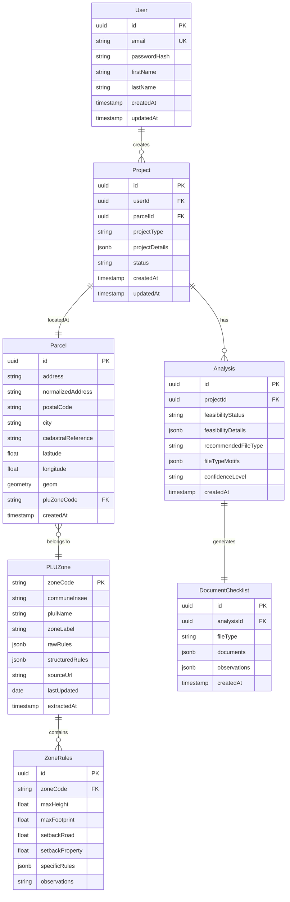
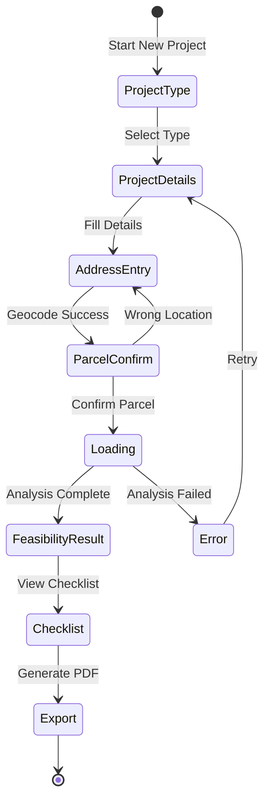
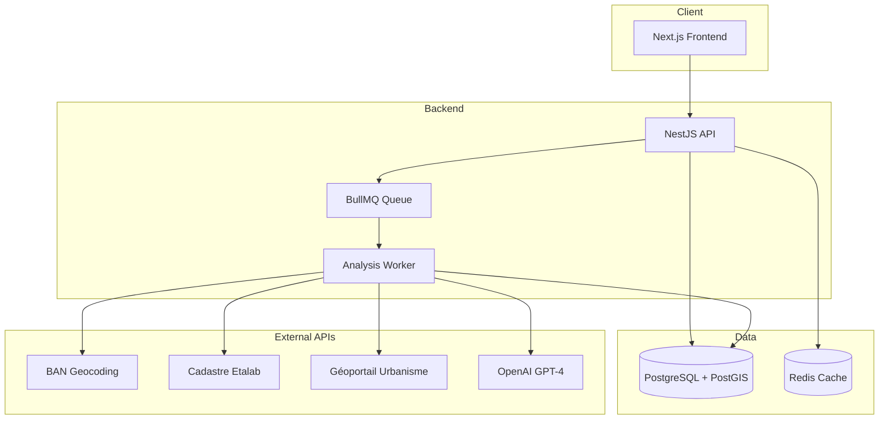
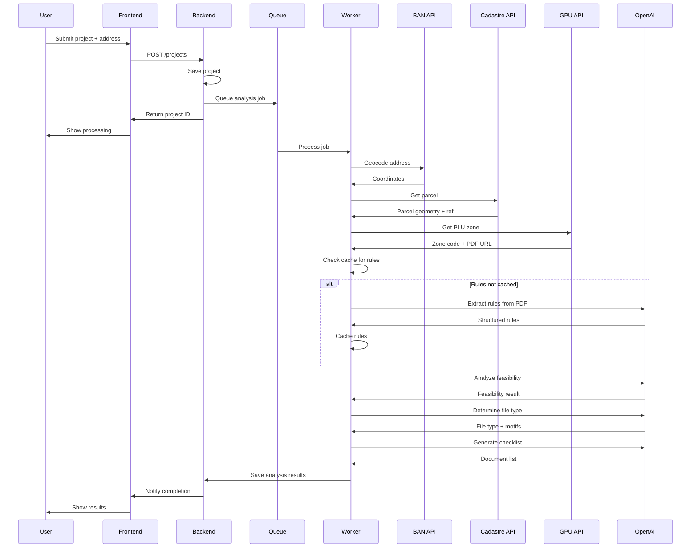

# Urban Planning Assistant - Technical Plan (V1)

## Table of Contents
1. [Project Summary](#1-project-summary)
2. [Core Features for V1](#2-core-features-for-v1)
3. [Technical Stack Recommendation](#3-technical-stack-recommendation)
4. [Data Model Design](#4-data-model-design)
5. [API Endpoints Design](#5-api-endpoints-design)
6. [Frontend Components Structure](#6-frontend-components-structure)
7. [Implementation Priority](#7-implementation-priority)
8. [Architecture Overview](#8-architecture-overview)
9. [External APIs Integration](#9-external-apis-integration)
10. [LLM Integration Strategy](#10-llm-integration-strategy)

---

## 1. Project Summary

### What is the Urban Planning Assistant?

The Urban Planning Assistant is an automated intelligent application that simplifies urban planning procedures for individuals in France. It helps users:

1. **Describe their construction project** (extension, pool, shed, facade work, etc.)
2. **Verify regulatory compatibility** by automatically analyzing local urban planning rules (PLU/PLUi)
3. **Determine the required authorization type** (Déclaration Préalable, Permis de Construire, Permis d'Aménager)
4. **Generate a personalized document checklist** for their application
5. **(Premium)** Handle the complete filing process with the municipality

### Target Users
- **Primary:** Individuals with construction projects
- **Secondary:** Architects, Notaries, Real estate agents

### Value Proposition
Transform a complex administrative journey into a simple, guided, and reliable experience by leveraging public geographic/regulatory data and LLM-powered analysis.

### Key Constraints
- The application provides **advisory assistance only** - not legal authority
- Results are **indicative** - only the municipality's decision is binding
- Initial geographic scope should be **limited** (1-2 intercommunalities) to reduce regulatory complexity

---

## 2. Core Features for V1

### 2.1 Essential Features (MVP)

| Feature | Description | Priority |
|---------|-------------|----------|
| **Project Qualification Chatbot** | Guided questionnaire to capture project details (type, dimensions, materials, location) | P0 |
| **Address Geocoding** | Convert user address to coordinates and identify parcel | P0 |
| **PLU Zone Retrieval** | Fetch zone code (U, AU, N, A) and basic constraints | P0 |
| **Basic Feasibility Analysis** | Compare project against zone rules (height, setbacks, footprint) | P0 |
| **Authorization Type Determination** | Identify DP/PC/PA requirement | P0 |
| **Document Checklist Generation** | List required documents (CERFA, plans, photos) | P0 |
| **PDF Summary Export** | Generate downloadable analysis summary | P1 |
| **User Account Management** | Basic registration, login, project history | P1 |

### 2.2 Features Deferred to V2

| Feature | Reason for Deferral |
|---------|---------------------|
| Premium filing service | Requires legal/operational setup |
| CERFA pre-filling | Complex form generation |
| ABF zone detection | Additional API integration |
| Risk zone analysis (floods, etc.) | Additional API integration |
| Project variant suggestions | Complex LLM orchestration |
| Pro subscription model | B2B features |

### 2.3 Supported Project Types (V1)

Focus on simple, common project types:
- Swimming pools (in-ground, above-ground)
- Extensions (single-story)
- Garden sheds / Annexes
- Fences / Gates
- Facade modifications

---

## 3. Technical Stack Recommendation

### 3.1 Backend

| Component | Technology | Justification |
|-----------|------------|---------------|
| **Runtime** | Node.js (v20+) with TypeScript | Fast development, excellent async handling for API calls |
| **Framework** | NestJS | Structured architecture, excellent TypeScript support, built-in DI |
| **Database** | PostgreSQL + PostGIS | Robust relational DB with geospatial capabilities |
| **ORM** | Prisma | Type-safe database access, excellent DX |
| **Cache** | Redis | Cache PLU rules, session management |
| **Queue** | BullMQ (Redis-based) | Handle async LLM calls, email notifications |

### 3.2 Frontend

| Component | Technology | Justification |
|-----------|------------|---------------|
| **Framework** | Next.js 14+ (App Router) | SSR, excellent performance, API routes |
| **Language** | TypeScript | Type safety, better DX |
| **UI Library** | Tailwind CSS + shadcn/ui | Fast styling, accessible components |
| **State Management** | Zustand | Lightweight, simple state management |
| **Forms** | React Hook Form + Zod | Form handling with validation |
| **Maps** | Leaflet or MapLibre GL | Display parcels, zones |

### 3.3 LLM Integration

| Component | Technology | Justification |
|-----------|------------|---------------|
| **Primary LLM** | OpenAI GPT-4o | Best reasoning for regulatory analysis |
| **Fallback** | Claude 3.5 Sonnet | Alternative for cost optimization |
| **Framework** | LangChain or direct SDK | Structured prompting, output parsing |

### 3.4 Infrastructure

| Component | Technology | Justification |
|-----------|------------|---------------|
| **Hosting** | Vercel (Frontend) + Railway/Render (Backend) | Simple deployment, good free tiers |
| **File Storage** | S3-compatible (Cloudflare R2) | PDF storage, cost-effective |
| **Monitoring** | Sentry + Posthog | Error tracking, analytics |

### 3.5 Alternative Stack (Simpler)

For faster MVP delivery, consider:
- **Backend:** Supabase (PostgreSQL + Auth + Edge Functions)
- **Frontend:** Next.js with Supabase client
- **Benefits:** Faster development, built-in auth, real-time capabilities

---

## 4. Data Model Design

### 4.1 Entity Relationship Diagram



### 4.2 Key JSON Structures

#### Project Details (stored in `Project.projectDetails`)

```json
{
  "typeProjet": "piscine",
  "descriptionLibre": "Piscine enterrée de 32m² dans le jardin",
  "travaux": {
    "categorie": "construction_nouvelle",
    "surfaceCreee": 32,
    "hauteurMax": 1.5,
    "nombreNiveaux": 0,
    "estAccoleBatimentExistant": false,
    "usage": "habitation_principale",
    "caracteristiquesSpecifiques": {
      "piscineType": "enterree",
      "piscineAbri": false
    }
  },
  "implantation": {
    "distanceLimiteSeparation": 4,
    "distanceVoiePublique": 8,
    "positionParcelle": "arriere"
  }
}
```

#### Structured Zone Rules (stored in `PLUZone.structuredRules`)

```json
{
  "zoneCode": "Ua",
  "zoneIntitule": "Zone urbaine à usage habitation",
  "reglesGenerales": {
    "hauteurMaximale": { "valeurMetres": 9, "commentaire": "Hauteur égout du toit" },
    "empriseMaximale": { "ratioMax": 0.4, "commentaire": "40% max superficie" },
    "reculVoiePublique": { "valeurMetres": 5, "commentaire": "" },
    "reculLimitesSeparatives": { "valeurMetres": 3, "commentaire": "" }
  },
  "reglesSpecifiques": {
    "piscine": { "autorisee": true, "surfaceMaxSansPC": 100, "conditions": [] },
    "annexes": { "autorisees": true, "surfaceMax": 40, "hauteurMaxAnnexe": 3.5 }
  },
  "observations": []
}
```

#### Feasibility Analysis Result (stored in `Analysis.feasibilityDetails`)

```json
{
  "etatFaisabilite": "compatible_a_risque",
  "resume": "Le projet semble possible mais la distance à la limite est juste.",
  "pointsPositifs": [
    "Surface inférieure à 100 m²",
    "Terrain en zone U"
  ],
  "pointsDeRisque": [
    {
      "type": "distance_limite",
      "description": "Distance à 3m, minimum réglementaire",
      "gravite": "moyenne"
    }
  ],
  "motifsProbablesRefus": [],
  "propositionsAjustement": []
}
```

---

## 5. API Endpoints Design

### 5.1 Authentication Endpoints

| Method | Endpoint | Description |
|--------|----------|-------------|
| POST | `/api/auth/register` | Create new user account |
| POST | `/api/auth/login` | Authenticate user |
| POST | `/api/auth/logout` | End user session |
| POST | `/api/auth/refresh` | Refresh access token |
| GET | `/api/auth/me` | Get current user info |

### 5.2 Project Endpoints

| Method | Endpoint | Description |
|--------|----------|-------------|
| GET | `/api/projects` | List user projects |
| POST | `/api/projects` | Create new project |
| GET | `/api/projects/:id` | Get project details |
| PATCH | `/api/projects/:id` | Update project |
| DELETE | `/api/projects/:id` | Delete project |

### 5.3 Analysis Endpoints

| Method | Endpoint | Description |
|--------|----------|-------------|
| POST | `/api/projects/:id/analyze` | Trigger full analysis pipeline |
| GET | `/api/projects/:id/analysis` | Get analysis results |
| GET | `/api/projects/:id/checklist` | Get document checklist |
| GET | `/api/projects/:id/export/pdf` | Export analysis as PDF |

### 5.4 Geocoding & Parcel Endpoints

| Method | Endpoint | Description |
|--------|----------|-------------|
| GET | `/api/geocode?address=...` | Geocode address (proxy BAN) |
| GET | `/api/parcel?lat=...&lng=...` | Get parcel from coordinates |
| GET | `/api/parcel/:cadastralRef` | Get parcel by cadastral reference |
| GET | `/api/parcel/:id/zone` | Get PLU zone for parcel |

### 5.5 Reference Data Endpoints

| Method | Endpoint | Description |
|--------|----------|-------------|
| GET | `/api/project-types` | List supported project types |
| GET | `/api/file-types` | List authorization file types |
| GET | `/api/documents/:fileType` | Get standard documents for file type |

### 5.6 Conversational Flow Endpoints (Alternative)

For a more chatbot-like experience:

| Method | Endpoint | Description |
|--------|----------|-------------|
| POST | `/api/chat/session` | Start new chat session |
| POST | `/api/chat/session/:id/message` | Send message, get next step |
| GET | `/api/chat/session/:id/state` | Get current conversation state |

---

## 6. Frontend Components Structure

### 6.1 Page Structure

```
app/
├── (auth)/
│   ├── login/page.tsx
│   └── register/page.tsx
├── (dashboard)/
│   ├── layout.tsx
│   ├── page.tsx                    # Dashboard home
│   ├── projects/
│   │   ├── page.tsx                # Projects list
│   │   ├── new/page.tsx            # New project wizard
│   │   └── [id]/
│   │       ├── page.tsx            # Project detail
│   │       ├── analysis/page.tsx   # Analysis results
│   │       └── checklist/page.tsx  # Document checklist
│   └── settings/page.tsx
├── (public)/
│   ├── page.tsx                    # Landing page
│   └── demo/page.tsx               # Interactive demo
└── layout.tsx
```

### 6.2 Core Components

#### Project Wizard Components

| Component | Purpose |
|-----------|---------|
| `ProjectTypeSelector` | Grid of project type cards with icons |
| `ProjectDetailsForm` | Dynamic form based on project type |
| `AddressInput` | Address autocomplete with map preview |
| `ParcelConfirmation` | Map showing identified parcel |
| `DimensionsForm` | Surface, height, distances inputs |
| `WizardStepper` | Step indicator and navigation |

#### Analysis Components

| Component | Purpose |
|-----------|---------|
| `FeasibilityResult` | Colored status badge + summary |
| `RuleComparisonTable` | Project values vs PLU rules |
| `RiskPointsList` | List of identified risks |
| `FileTypeCard` | Recommended authorization type |
| `ChecklistTable` | Interactive document checklist |

#### Map Components

| Component | Purpose |
|-----------|---------|
| `AddressMap` | Leaflet map for address selection |
| `ParcelOverlay` | Polygon overlay of parcel boundary |
| `ZoneIndicator` | PLU zone label on map |

#### Shared Components

| Component | Purpose |
|-----------|---------|
| `LoadingSpinner` | Loading state indicator |
| `ErrorAlert` | Error message display |
| `InfoTooltip` | Contextual help tooltips |
| `DownloadButton` | PDF export button |
| `StepCard` | Collapsible step container |

### 6.3 UI State Flow



---

## 7. Implementation Priority

### Phase 1: Foundation (Weeks 1-2)

1. **Project Setup**
   - Initialize Next.js frontend with TypeScript
   - Initialize NestJS backend with TypeScript
   - Set up PostgreSQL with PostGIS
   - Configure Prisma ORM with initial schema
   - Set up development environment (Docker Compose)

2. **Authentication**
   - User registration and login
   - JWT token management
   - Protected route middleware

3. **Basic Project CRUD**
   - Create/read/update/delete projects
   - Project list view
   - Project detail view

### Phase 2: Geocoding & Data Pipeline (Weeks 3-4)

4. **Address Geocoding Integration**
   - BAN API integration
   - Address autocomplete component
   - Coordinate extraction

5. **Parcel Identification**
   - Cadastre API integration
   - Parcel polygon retrieval
   - Map display with parcel overlay

6. **PLU Zone Retrieval**
   - Géoportail Urbanisme API integration
   - Zone code extraction
   - Basic zone information storage

### Phase 3: LLM Integration & Analysis (Weeks 5-6)

7. **Rules Extraction Pipeline**
   - PLU PDF download mechanism
   - OpenAI API integration
   - Rules extraction prompt
   - Structured rules storage and caching

8. **Feasibility Analysis**
   - Project vs Rules comparison prompt
   - Feasibility status determination
   - Risk identification

9. **File Type Determination**
   - Authorization type prompt
   - DP/PC/PA classification
   - Confidence level assessment

### Phase 4: Output Generation (Weeks 7-8)

10. **Document Checklist**
    - Checklist generation prompt
    - Interactive checklist UI
    - Document requirements by file type

11. **PDF Export**
    - Analysis summary template
    - PDF generation (puppeteer or react-pdf)
    - Download functionality

12. **Final Polish**
    - Error handling improvements
    - Loading states and feedback
    - Mobile responsiveness
    - Legal disclaimers

### Milestone Summary

| Phase | Duration | Key Deliverable |
|-------|----------|-----------------|
| 1 | 2 weeks | Working auth + project management |
| 2 | 2 weeks | Address → Parcel → Zone pipeline |
| 3 | 2 weeks | LLM-powered feasibility analysis |
| 4 | 2 weeks | Complete user journey with PDF export |

**Total V1 Timeline: 8 weeks**

---

## 8. Architecture Overview

### 8.1 System Architecture Diagram



### 8.2 Analysis Pipeline Flow



---

## 9. External APIs Integration

### 9.1 BAN (Base Adresse Nationale)

**Purpose:** Address geocoding

**Endpoint:** `https://api-adresse.data.gouv.fr/search/`

**Example Request:**
```
GET /search/?q=12+rue+des+lilas+75020+paris&limit=5
```

**Key Response Fields:**
```json
{
  "features": [{
    "properties": {
      "label": "12 Rue des Lilas 75020 Paris",
      "postcode": "75020",
      "city": "Paris",
      "citycode": "75120"
    },
    "geometry": {
      "coordinates": [2.3522, 48.8566]
    }
  }]
}
```

### 9.2 Cadastre (Etalab)

**Purpose:** Parcel identification from coordinates

**Endpoint:** `https://apicarto.ign.fr/api/cadastre/parcelle`

**Example Request:**
```
GET /api/cadastre/parcelle?geom={"type":"Point","coordinates":[2.3522,48.8566]}
```

**Key Response Fields:**
- `numero`: Parcel number
- `section`: Section code
- `code_dep`: Department code
- `geometry`: Polygon geometry

### 9.3 Géoportail Urbanisme (GPU)

**Purpose:** PLU zone and regulations

**Endpoint:** `https://data.geopf.fr/wfs` (WFS service)

**Key Layers:**
- `ZONE_URBA`: Urban planning zones
- `SECTEUR_CC`: Special sectors
- `DOC_URBA`: PLU documents metadata

**Note:** GPU requires handling WFS protocol. Consider using a library like `ol` (OpenLayers) or direct XML parsing.

### 9.4 Rate Limits and Caching Strategy

| API | Rate Limit | Caching Strategy |
|-----|------------|------------------|
| BAN | Generous (no key) | Cache addresses for 24h |
| Cadastre | Moderate | Cache parcels indefinitely |
| GPU | Moderate | Cache zone rules indefinitely (until PLU update) |
| OpenAI | By plan | Cache LLM responses per zone |

---

## 10. LLM Integration Strategy

### 10.1 Prompt Templates

#### Rules Extraction Prompt

```
System: Tu es un assistant juridique spécialisé en urbanisme français.
Tu dois extraire les règles d'urbanisme d'un extrait de PLU en JSON.
Réponds UNIQUEMENT en JSON valide.
Si une information n'est pas présente, utilise null.

User: Voici l'extrait du règlement pour la zone "{zoneCode}":
--- DEBUT ---
{pluText}
--- FIN ---

Remplis ce JSON:
{jsonSchema}
```

#### Feasibility Analysis Prompt

```
System: Tu es un assistant spécialisé en urbanisme.
Tu reçois un projet et des règles de zone.
Tu dois évaluer la compatibilité de manière indicative.
Réponds en JSON selon le schéma fourni.

User:
Projet: {projectJson}
Règles: {rulesJson}

Analyse la compatibilité et renvoie le résultat.
```

### 10.2 Output Parsing

Use structured output with JSON schema validation:

```typescript
const feasibilitySchema = z.object({
  etatFaisabilite: z.enum(['compatible', 'compatible_a_risque', 'probablement_incompatible']),
  resume: z.string(),
  pointsPositifs: z.array(z.string()),
  pointsDeRisque: z.array(z.object({
    type: z.string(),
    description: z.string(),
    gravite: z.enum(['faible', 'moyenne', 'elevee'])
  })),
  motifsProbablesRefus: z.array(z.object({
    type: z.string(),
    description: z.string()
  })),
  propositionsAjustement: z.array(z.object({
    description: z.string(),
    impactSurProjet: z.enum(['faible', 'moyen', 'important'])
  }))
});
```

### 10.3 Cost Optimization

1. **Cache aggressively**: Zone rules rarely change - extract once, reuse forever
2. **Batch when possible**: Combine analysis steps where feasible
3. **Use cheaper models for simple tasks**: GPT-3.5 for file type determination
4. **Implement fallbacks**: If GPT-4 fails, retry with GPT-3.5

### 10.4 Error Handling

- Retry with exponential backoff on rate limits
- Fallback to generic analysis if zone-specific rules unavailable
- Always validate LLM output against schema
- Log all LLM interactions for debugging and improvement

---

## Appendix A: Legal Disclaimers (Required)

All analysis results must include:

> **Avertissement** : Cette analyse est fournie à titre indicatif uniquement.
> Elle ne constitue pas un conseil juridique et ne garantit pas l'obtention
> d'une autorisation d'urbanisme. Seule la décision du service instructeur
> de votre mairie fait foi. Nous vous recommandons de consulter le service
> urbanisme de votre commune pour confirmer la faisabilité de votre projet.

---

## Appendix B: Glossary

| Term | Meaning |
|------|---------|
| **PLU** | Plan Local d'Urbanisme (Local Urban Plan) |
| **PLUi** | Plan Local d'Urbanisme intercommunal |
| **DP** | Déclaration Préalable (Prior Declaration) |
| **PC** | Permis de Construire (Building Permit) |
| **PA** | Permis d'Aménager (Development Permit) |
| **ABF** | Architecte des Bâtiments de France |
| **GPU** | Géoportail de l'Urbanisme |
| **BAN** | Base Adresse Nationale |
| **CERFA** | Official French administrative form |
| **SUP** | Servitude d'Utilité Publique |

---

## Appendix C: File Type Decision Matrix

| Project Type | Surface Threshold | Authorization Type |
|--------------|-------------------|-------------------|
| Pool (no cover) | ≤ 100m² | DP |
| Pool (no cover) | > 100m² | PC |
| Pool with cover | ≤ 100m² and cover < 1.8m | DP |
| Pool with cover | cover ≥ 1.8m | PC |
| Extension | ≤ 20m² (or 40m² in PLU zone) | DP |
| Extension | > 20m² (or 40m²) | PC |
| Garden shed | ≤ 5m² | None |
| Garden shed | 5-20m² | DP |
| Garden shed | > 20m² | PC |
| Fence | < 2m height | Usually DP |
| Fence | ≥ 2m or in protected zone | PC |

*Note: Thresholds may vary by PLU zone and special protections (ABF, etc.)*
